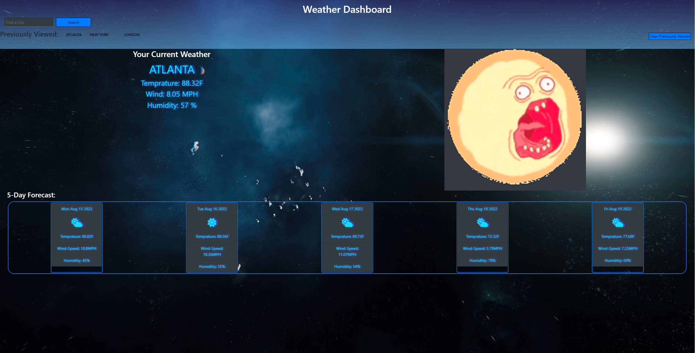

# Weather Dashboard

# What is this?
- This is a Weather Dashboard built using openweathermap API 
- With this weather map you can search any city you plan to travel to or currently live in and get your current
weather as well as the 5 day forecast
- I built this app as part of a requirement for my developement certification as well as a display of my work for future employers 
- You should note that UV-Index has been removed from onecall V 2.5 and V 3.0 requires credit card information. I do not have a way to hide API keys so I will be removing UV-Index from this project until such a time as to where I am able to hide my API-Keys.

# Installation 
- No installation required, you can use this weather dashboard in your browser

# Usage
- Upon page load you will be prompted to allow your location followed by another prompt
to enter your location as I am not paying for google maps API due to not having a way to hide my API keys right now. Once you enter the city name of the location in which you reside or your IP address is linked to, the current weather and 5 day forecast will be displayed for your city. If your request's for location are turned off you will get an alert warning you to either turn them on or refresh the page and allow location. 

- If you would not like to use your location, type in the city you are searching for and  press the search button. Mind you spelling is important. If you do not spell your city name correctly you will get an error. Upon pressing search your current weather and 5 day forecast will be displayed.

- The API-Key used is free and there is nothing special about using it, so dont get excited if your an API-Key Pirate!

- Your geolocation is not appended to the previously viewed cities as this JS file is already long enough and that is not a requirement of this project anyways. If you would like to add clone this repository and add it to this page, feel free to do so. I do however plan on adding that feature later on when I refactor this page using a different language.

- You can view and use this page at (https://sspenelope.github.io/Weather-Dashboard/)

# Bugs
- There is currently a bug for anyone who uses apple IOS v15.0 or higher. For some reason the 5 day forecast likes to push off to the side of the screen and you are forced to scroll over. Im not that expierenced of a developer to be troubleshooting IOS updates but I will attempt to fix this in the future.

- Be aware that depending on the users browser and settings, sometimes an error will be created due to the geolocation automaticaly being block. Its caused by the function not being shut down immediatly by the user declining geolocation. No worries though, the page will function and operate correctly and if the user should choose, they can change their settings and use the geolocation feature which should produce no errors.

# Credits
- Big thanks to "dcode" on youtube for posting the video on how to use geolocation in JavaScript. Some of my code used in my getGelocation function came from his video. You can check his video out at (https://www.youtube.com/watch?v=916M64DuRnk&ab_channel=dcode)

- All the askBCS assistants who helped me out when I was stuck on a hard problem or bug

- The awesome instructors at the UofM Coding Bootcamp for making coding fun and providing me with all the knowledge necessary to build this page

